<!-- Este template foi criado para servir como referência e pode ser facilmente adaptado para diferentes projetos de desenvolvimento -->

<!--  
-->

 

---

# 🌐 Cstic 

<table>
  <tr>
    <td width="800px">
      

       Sistema web para gestão de chamados de TI, desenvolvido para centralizar o atendimento técnico, proporcionando controle, rastreabilidade e eficiência em todas as etapas do processo, desde a abertura do chamado até sua finalização mediante validação do usuário.
      

    </td>
    <td>
      

        
      

    </td>
  </tr> 
</table>

---

## 🚧 Status do Projeto

---

## 📚 Índice
- [Links Úteis](#-links-úteis)
- [Sobre o Projeto](#-sobre-o-projeto)
- [Funcionalidades Principais](#-funcionalidades-principais)
- [Tecnologias Utilizadas](#-tecnologias-utilizadas)
- [Arquitetura](#-arquitetura)
- [Exemplos de diagramas](#exemplos-de-diagramas)
- [Documentações utilizadas](#-documentações-utilizadas)
- [Autores](#-autores)
- [Contribuição](#-contribuição)
- [Agradecimentos](#-agradecimentos)
- [Licença](#-licença)

---

## 🔗 Links Úteis
* 🌐 📄 Documentação Completa (PDF): [Acessar Documentação do Projeto](<docs/Documentação de Projeto - CSTIC.pdf>)
--

## 📝 Sobre o Projeto
O projeto consiste em um sistema web para abertura e gestão de chamados voltado ao atendimento do setor de Tecnologia da Informação (TI). Sua criação surgiu da necessidade de organizar e otimizar os processos de suporte técnico, centralizando as solicitações dos usuários em uma única plataforma e proporcionando maior controle sobre todas as etapas do atendimento.

A solução busca resolver problemas comuns enfrentados por equipes de TI, como a falta de rastreabilidade dos atendimentos, dificuldades na comunicação entre usuários e técnicos e a ausência de um fluxo padronizado para acompanhamento e encerramento dos chamados. Para isso, o sistema oferece recursos como abertura e acompanhamento de chamados, atribuição de responsáveis, atualização de status e comunicação direta entre usuário e técnico por meio de um chat integrado, tornando o atendimento mais ágil, transparente e eficiente.

Outro diferencial da proposta é a adoção da validação do encerramento dos chamados por meio de assinatura digital do usuário solicitante. Além de garantir maior segurança, rastreabilidade e confiabilidade ao processo, essa funcionalidade reduz a necessidade de impressões e do uso de documentos físicos, contribuindo para a diminuição do consumo de papel e promovendo uma abordagem mais sustentável.

O sistema pode ser utilizado em empresas, instituições de ensino, órgãos públicos e demais organizações que possuam equipes de suporte técnico e necessitem gerenciar seus atendimentos de forma eficiente. Seu principal valor está em proporcionar uma melhor experiência tanto para os usuários quanto para os profissionais de TI, aumentando a organização, a produtividade e a qualidade dos serviços prestados.

---

## ✨ Funcionalidades Principais
Liste as funcionalidades de forma clara e objetiva.

- 🔐 **Autenticação Segura:** Login com diferentes níveis de acesso (Funcionário, Técnico e Administrador), recuperação de senha e gerenciamento seguro de sessões.
- 📈 **Painel de Controle (Dashboard):** Visualização em tempo real de indicadores e métricas, como quantidade de chamados por status, prioridades, categorias e desempenho da equipe técnica.
- ⚙️ **Gerenciamento de Chamados:** Criação, edição, acompanhamento, filtragem e consulta de chamados, com registro completo do histórico de alterações.
- 👥 **Controle de Perfis e Permissões:** Definição de permissões específicas para cada tipo de usuário, garantindo que apenas usuários autorizados possam executar determinadas ações.
- ⚡ **Priorização e Classificação:** Categorização dos chamados por tipo de solicitação (hardware, software, rede, acessos etc.) e definição automática ou manual de prioridades.
- 👨‍🔧 **Atribuição de Técnicos:** Encaminhamento dos chamados para setores e técnicos responsáveis, com acompanhamento do andamento do atendimento.
- 🔄 **Fluxo de Status do Atendimento:** Controle do ciclo de vida do chamado, incluindo os status de Aberto, Em Análise, Em Atendimento, Solucionado, Finalizado e Finalizado Automaticamente.
- 📎 **Anexos nos Chamados:** Possibilidade de anexar imagens, documentos e arquivos relevantes para auxiliar na identificação e resolução do problema.
- 💬 **Chat Integrado:** Canal de comunicação em tempo real entre usuário e técnico, permitindo esclarecimento de dúvidas, envio de orientações e acompanhamento mais transparente do atendimento.
- ✍️ **Validação por Assinatura Digital:** Após a resolução do problema, o usuário deve validar o atendimento por meio de uma assinatura digital, garantindo rastreabilidade e confirmação da solução aplicada.
- ⏳ **Encerramento Automático:** Chamados marcados como "Solucionados" são encerrados automaticamente após 7 dias sem manifestação do usuário, registrando essa ação para fins de auditoria.
- 📊 **Relatórios Exportáveis:** Exportação de dados em PDF, CSV ou Excel.
- 🌐 **Internacionalização (i18n):** Suporte a múltiplos idiomas.
- 🧵 **Logs e Monitoramento:** Registro detalhado de atividades e análise de desempenho.
- 📨 **Sistema de Notificações:** Envio de alertas por e-mail, push ou notificações internas.
- 📚 **Base de Conhecimento:** Disponibilização de soluções frequentes, tutoriais e perguntas recorrentes para reduzir o volume de chamados e agilizar o suporte.
  
---

## 🛠 Tecnologias Utilizadas

As seguintes ferramentas, frameworks e bibliotecas foram utilizados na construção deste projeto. Recomenda-se o uso das versões listadas (ou superiores) para garantir a compatibilidade.

### 💻 Front-end

* **Framework/Biblioteca:** [Ex: React v18, Vue.js v3, Angular v17]
* **Linguagem/Superset:** [Ex: TypeScript, JavaScript ES6+]
* **Estilização:** [Ex: Tailwind CSS, Sass, Styled Components, Material UI]
* **Gerenciamento de Estado:** [Ex: Redux Toolkit, Zustand, Context API]
* **Build Tool:** [Ex: Vite, Webpack]

### 🖥️ Back-end

* **Linguagem/Runtime:** [Ex: Java 17 (JDK), Node.js v20, Python 3.11]
* **Framework:** [Ex: Spring Boot 3.x, NestJS, Express, Django]
* **Banco de Dados:** [Ex: PostgreSQL, MySQL, MongoDB]
* **ORM / Query Builder:** [Ex: Hibernate/JPA, Prisma, TypeORM]
* **Autenticação:** [Ex: JWT, OAuth2, Spring Security]

### ⚙️ Infraestrutura & DevOps

* **Containerização:** [Ex: Docker, Docker Compose]
* **Orquestração:** [Ex: Kubernetes (K8s)]
* **Cloud:** [Ex: AWS (EC2, RDS, S3), Vercel, Heroku, Google Cloud]
* **CI/CD:** [Ex: GitHub Actions, Jenkins, SonarQube]

---

## 🏗 Arquitetura

O sistema foi projetado utilizando uma arquitetura baseada em microsserviços, com o objetivo de promover escalabilidade, organização do código, facilidade de manutenção e independência entre os principais módulos da aplicação. Essa abordagem permite que cada serviço seja responsável por um conjunto específico de funcionalidades do negócio, reduzindo o acoplamento e facilitando futuras evoluções do sistema. A escolha por essa arquitetura também possui caráter acadêmico, permitindo a aplicação prática de conceitos modernos amplamente utilizados no mercado, como API Gateway, comunicação assíncrona, separação de responsabilidades e integração entre serviços.

### Visão Geral da Arquitetura

A solução é composta por uma aplicação web responsável pela interação com os usuários e por diversos serviços especializados que executam as regras de negócio do sistema. Toda comunicação externa é centralizada por meio de um API Gateway, que atua como ponto único de entrada das requisições.

- Frontend (React): interface utilizada por funcionários, técnicos e administradores para acesso às funcionalidades do sistema.
- API Gateway: responsável por receber as requisições do frontend, validar autenticação e encaminhá-las ao microsserviço apropriado.
- Auth Service: realiza autenticação, recuperação de senha, autorização e gerenciamento das permissões dos usuários.
- User Service: administra usuários, perfis de acesso e departamentos.
- Ticket Service: núcleo do sistema, responsável pela abertura, acompanhamento, atualização e encerramento dos chamados.
- Chat Service: possibilita a comunicação em tempo real entre usuários e técnicos durante o atendimento.
- Notification Service: gerencia o envio de notificações internas e e-mails relacionados às alterações dos chamados.
- Report Service: disponibiliza dashboards e relatórios gerenciais para acompanhamento dos indicadores do suporte.
- Scheduler Service: executa rotinas automáticas, como o encerramento de chamados solucionados que permaneceram sem validação do usuário por mais de sete dias.
- RabbitMQ: mecanismo de mensageria utilizado para comunicação assíncrona entre os serviços.
- Database per Service: Cada Microsserviço com seu próprio banco isolado. Podendo ser tanto relacional quanto não relacional.
- Armazenamento de Arquivos: utilizado para guardar anexos enviados pelos usuários durante a abertura e atualização dos chamados.
- Serviço de E-mail: responsável pelo envio de notificações e solicitações de validação aos usuários.

### Fluxo de Dados

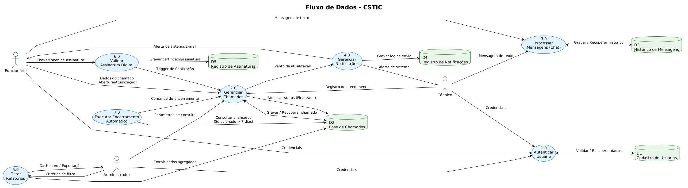

## Padrões de Projetos utilizados

Durante o desenvolvimento foram adotados diversos padrões arquiteturais e de projeto para promover organização e reutilização do código:

- Repository Pattern: abstração da camada de acesso aos dados;
- Service Layer: centralização das regras de negócio;
- DTO (Data Transfer Object): transferência segura de dados entre camadas e serviços;
- Controller Pattern: exposição dos endpoints da API;
- Event-Driven: utilização de eventos publicados no RabbitMQ para desacoplamento entre serviços;
- Dependency Injection: gerenciamento das dependências pelo framework;
- Scheduler: execução de tarefas periódicas automatizadas.

### Decisões Arquiteturais

A utilização de microsserviços foi motivada pela necessidade de separar responsabilidades e facilitar a evolução independente dos módulos do sistema. A adoção de mensageria permite que operações secundárias, como o envio de notificações, sejam executadas de forma assíncrona, melhorando o desempenho percebido pelos usuários. A validação do encerramento por assinatura digital foi incorporada como uma decisão de negócio importante, garantindo rastreabilidade do atendimento, maior confiabilidade no processo de suporte e redução do uso de documentos físicos, contribuindo para uma proposta mais sustentável.

## Trade-off e Limitações

Apesar dos benefícios relacionados à escalabilidade e modularidade, a arquitetura baseada em microsserviços aumenta a complexidade da infraestrutura e exige maior esforço de configuração, monitoramento e integração entre os serviços. Em cenários menores, uma arquitetura monolítica modular poderia atender às necessidades do sistema com menor custo operacional. Entretanto, considerando os objetivos acadêmicos do projeto e a intenção de aplicar práticas modernas de desenvolvimento utilizadas no mercado, a adoção dessa arquitetura mostrou-se adequada, proporcionando uma solução robusta, extensível e alinhada às demandas de um ambiente real de suporte técnico.

## 📊 Diagramas e Modelagem

### 1. Diagrama de Arquitetura
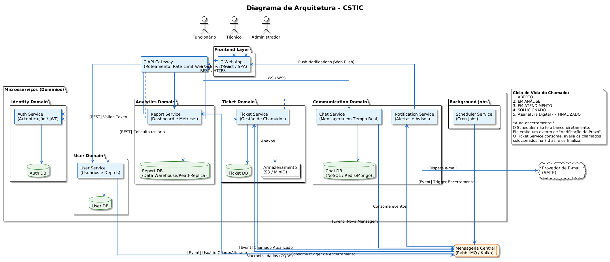

### 2. Diagrama de Casos de Uso
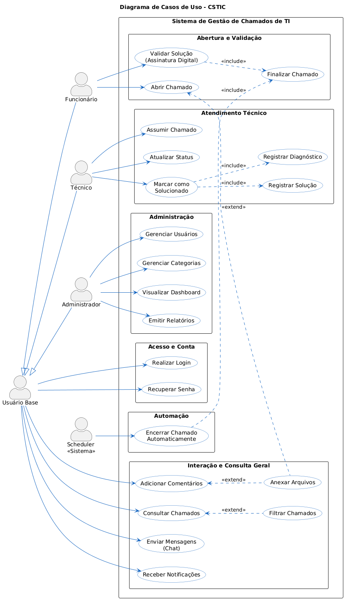

### 3. Diagrama de Classes
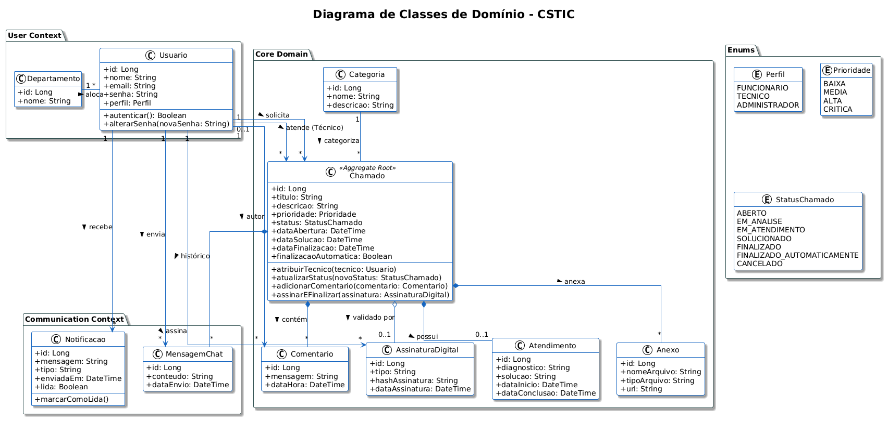

### 4. Diagrama de Pacotes
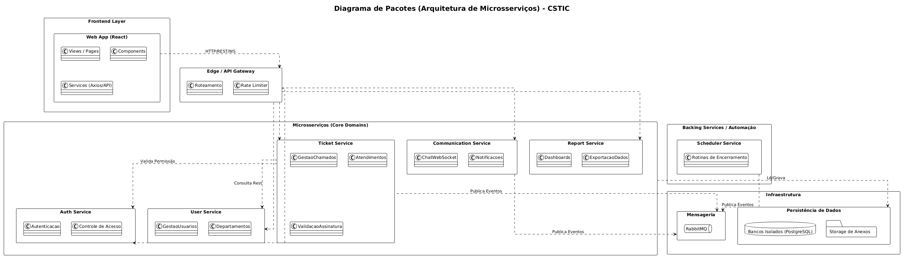

### 5. Diagrama de Componentes
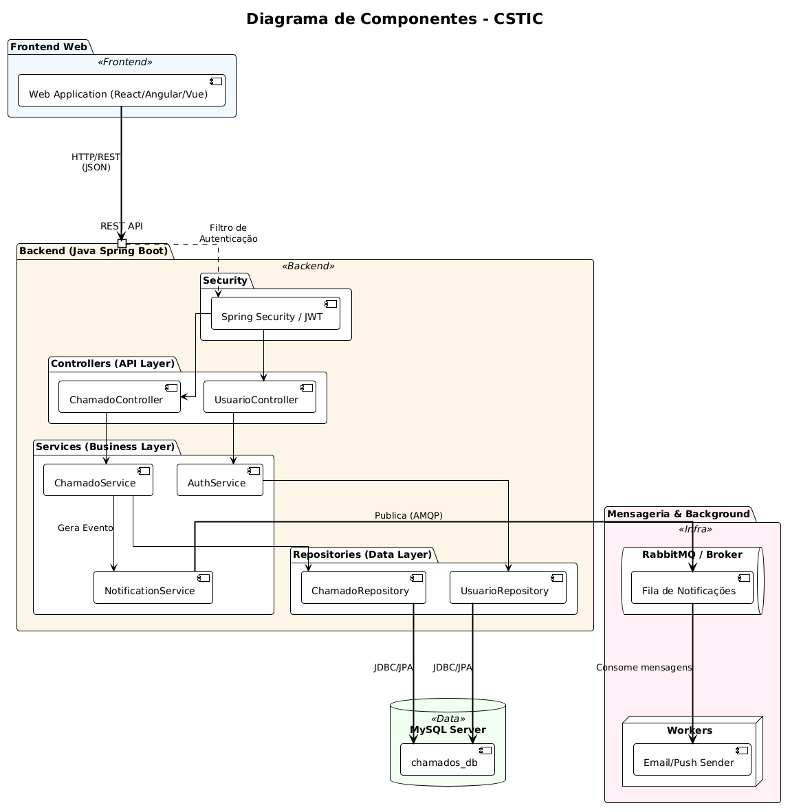

### 6. Diagrama de Implantação
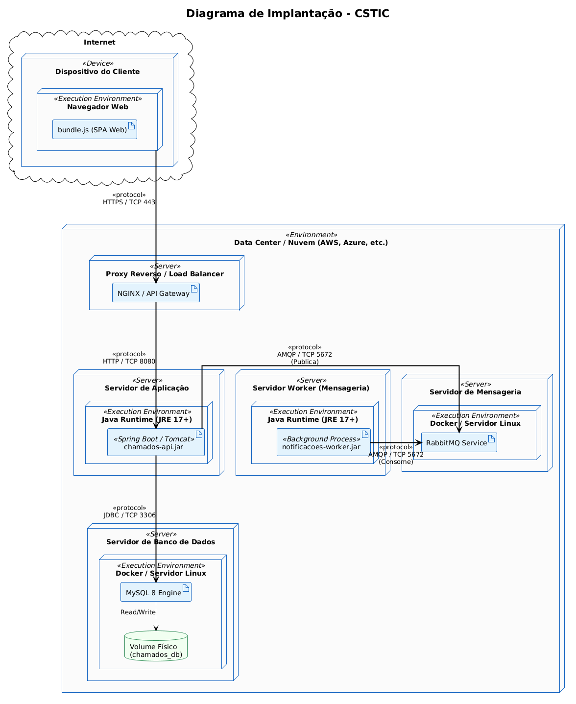

### 7. Diagrama de Comunicação
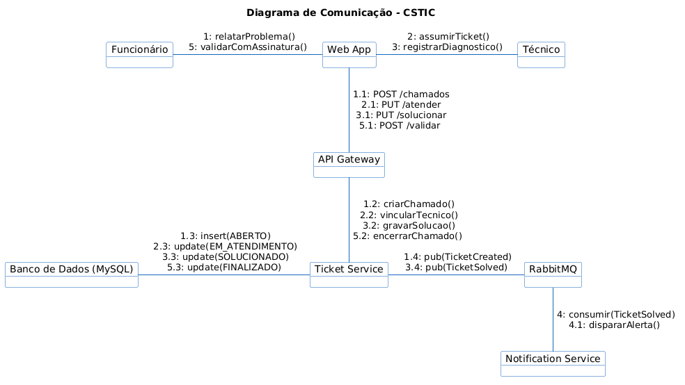

### 8. Diagrama de Entidade e Relacionamento
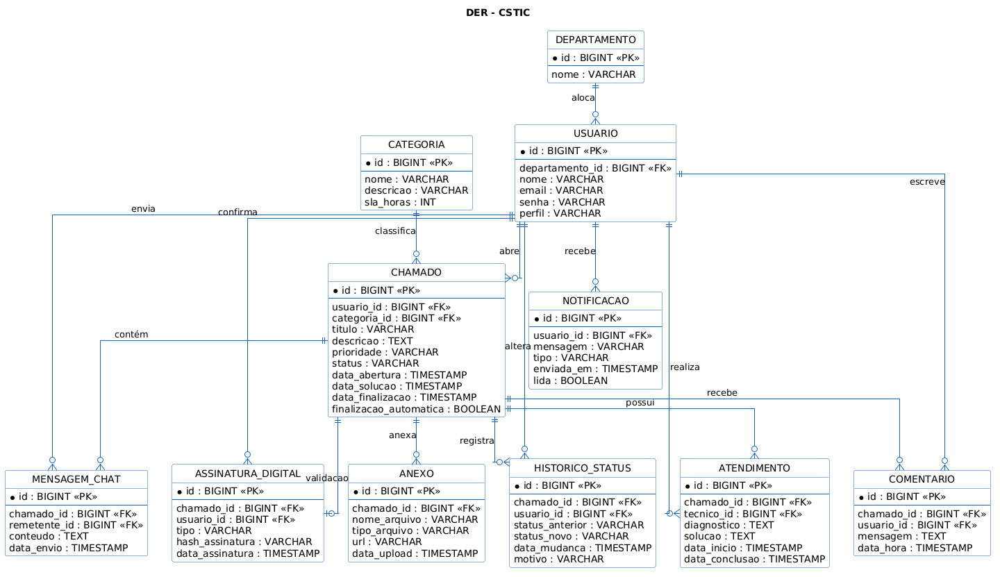

### 9. Diagrama de Estados
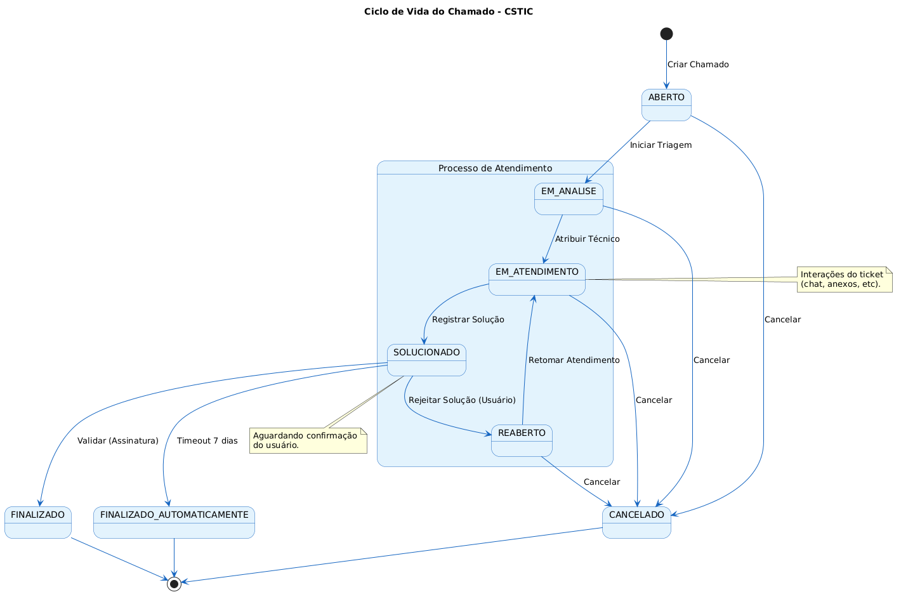

### 10. Diagrama de Sequência Geral

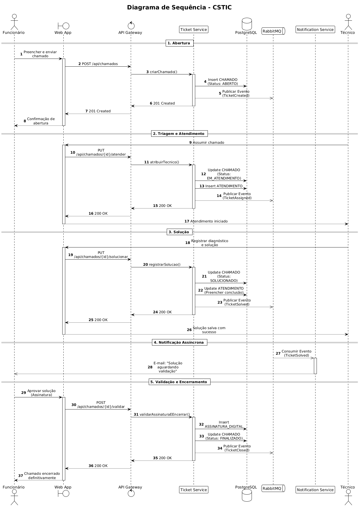

### 11. Diagrama de Sequência Abertura de Chamados

### 12. Diagrama de Sequência Validação de Usuário

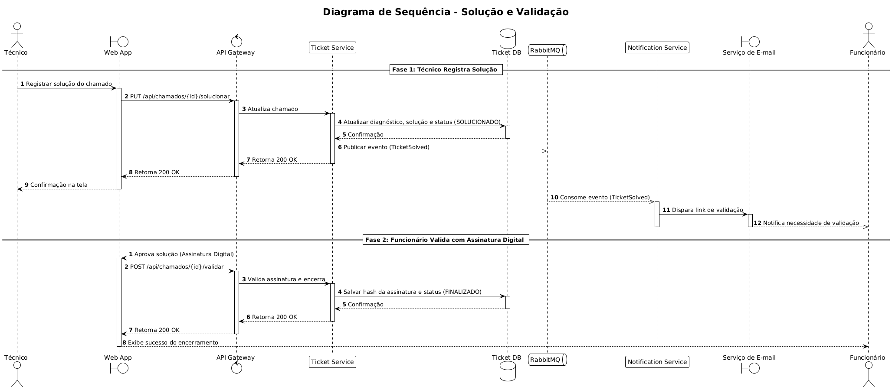

### 13.  Diagrama de Sequência Encerramento Automático

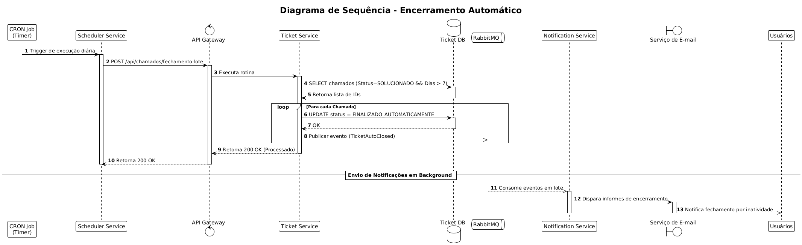

### 14.  Diagrama de Sequência Chat em Tempo Real

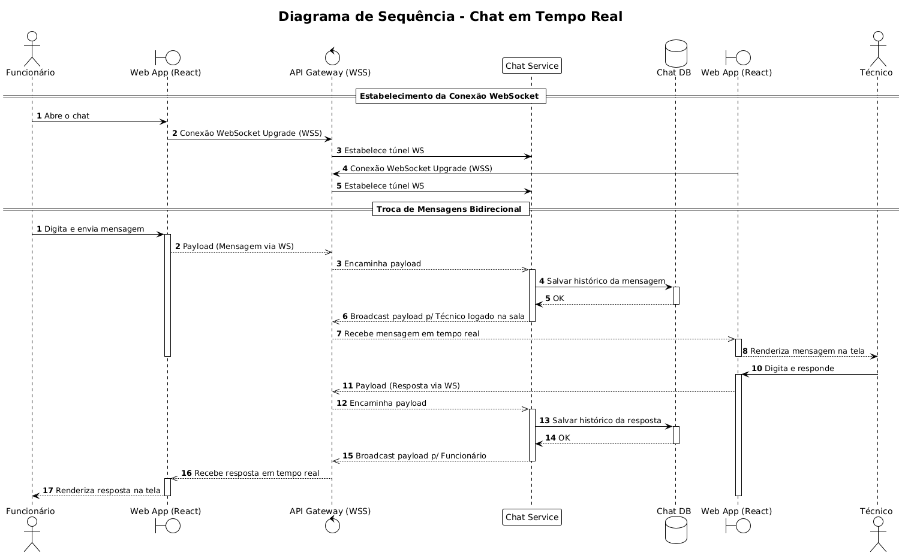

---

## 👥 Autores

| 👤 Nome | :octocat: GitHub |
|---------|----------|
| Francisco Rodrigues | [@CiscoRafael](https://github.com/CiscoRafael) |

---

## 🤝 Contribuição
1. Faça um `fork` do projeto.
2. Crie uma branch para sua feature (`git checkout -b feature/minha-feature`).
3. Commit suas mudanças (`git commit -m 'feat: Adiciona nova funcionalidade X'`). Utilize o padrão **Conventional Commits**.
4. Faça o `push` para a branch (`git push origin feature/minha-feature`).
5. Abra um **Pull Request (PR)**.

---

## 🙏 Agradecimentos
Gostaria de agradecer aos seguintes canais e pessoas que foram fundamentais para o desenvolvimento deste projeto:

* [**Engenharia de Software PUC Minas**](https://www.instagram.com/engsoftwarepucminas/) - Pelo apoio institucional, estrutura acadêmica e fomento à inovação e boas práticas de engenharia.
* [**Prof. Dr. João Paulo Aramuni**](https://github.com/joaopauloaramuni) - Pelos valiosos ensinamentos sobre **Arquitetura de Software** e **Padrões de Projeto**.

---

## 📄 Licença
Este projeto é distribuído sob a **[Licença MIT](./LICENSE)**.

---
